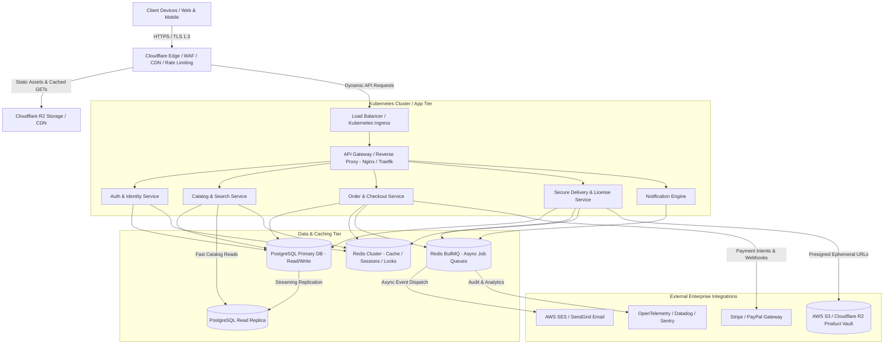
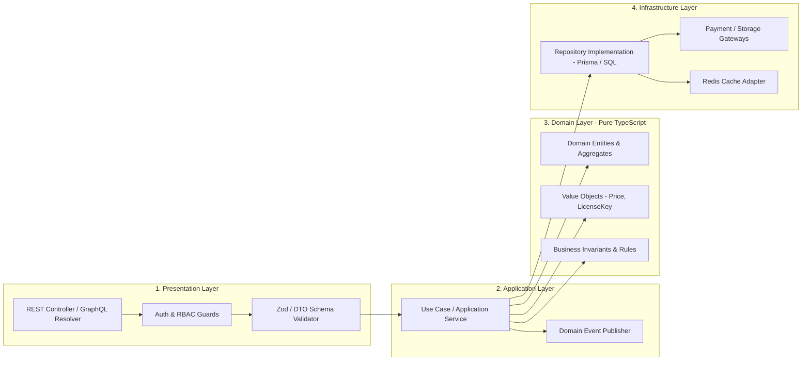
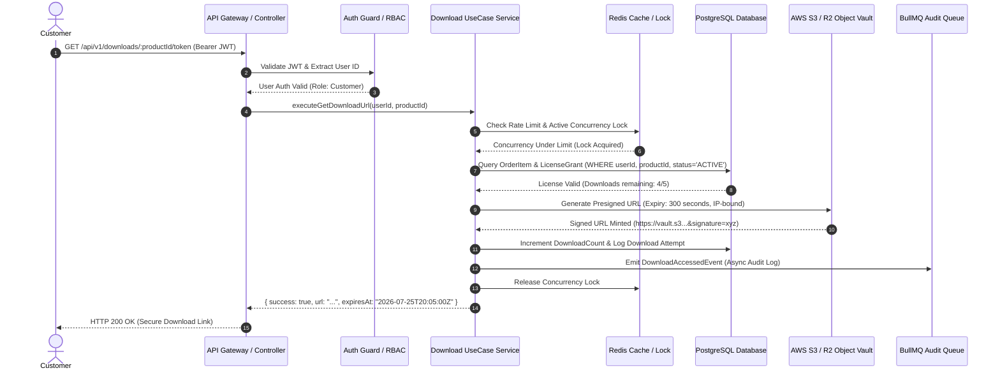
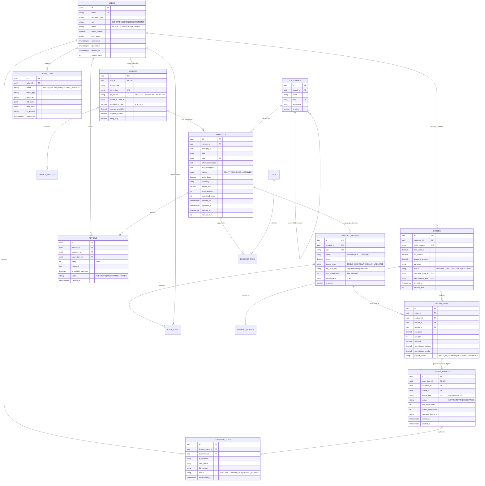
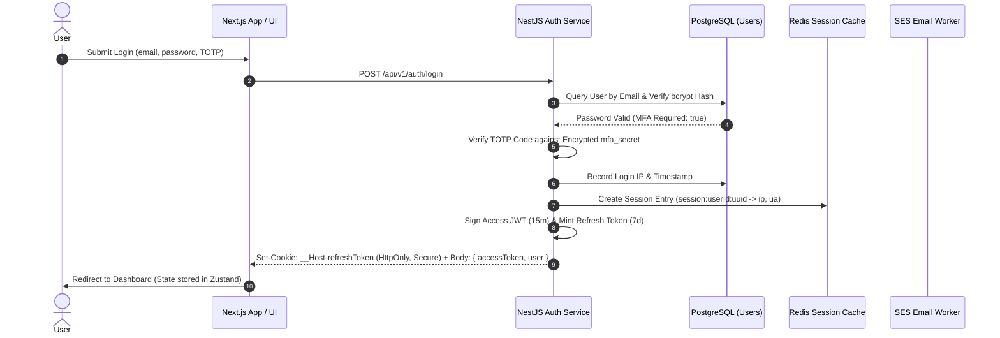
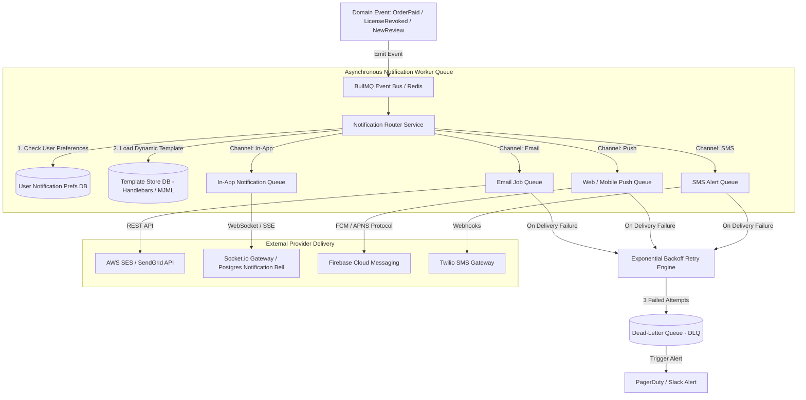

# Long-Term Memory (LTM) - Enterprise Digital Product Marketplace Architecture

## 1. Executive Project Overview
- **Project Name:** Digital Product Marketplace Platform
- **Core Purpose:** A high-performance, enterprise-grade, fault-tolerant, and secure multi-vendor marketplace for digital products (software, scripts, themes, plugins, e-books, audio/video assets, and digital licensing). Designed for zero-downtime scalability, seamless future feature expansion, and high concurrency.
- **Primary Tech Stack:**
  - **Frontend:** Next.js 14+ (App Router, Server Actions, React Server Components), TypeScript (strict mode), Vanilla CSS / Custom Modern Design System (vibrant palettes, dark mode, glassmorphism, micro-animations), TanStack Query, Zustand.
  - **Backend:** Node.js with NestJS / Express + TypeScript (Clean Architecture, Domain-Driven Design), OpenTelemetry instrumentation, REST & GraphQL APIs.
  - **Database & Caching:** PostgreSQL (Primary relational data store with range/hash partitioning), Redis (Distributed caching, session storage, rate limiting, and BullMQ asynchronous job queues), Object Storage (AWS S3 / Cloudflare R2 with encrypted at-rest storage and CDN edge delivery).
  - **ORMs & Validation:** Prisma / Drizzle ORM with strict schema versioning and migration enforcement; Zod / Pydantic runtime boundary validation.
  - **Infrastructure & DevOps:** Docker, Kubernetes (EKS/GKE), Terraform (IaC), GitHub Actions CI/CD pipelines, Cloudflare WAF & CDN.

---

## 2. Architectural Blueprint & Core Principles
- **Pattern:** Modular Monolith migrating to Bounded Microservices (Domain-Driven Design).
- **Design Principles:**
  - **High Cohesion, Low Coupling:** Modules communicate via well-defined domain interfaces or asynchronous event buses (Redis/RabbitMQ).
  - **Clean Architecture:** Separation of Presentation (Controllers), Application (Use Cases/Services), Domain (Entities/Business Rules), and Infrastructure (Repositories/External Adapters).
  - **Zero-Hardcoding & Dynamic Configuration:** All system rules, feature toggles, tax rates, currency conversions, and localization strings are dynamically driven via database configurations and environment variables (`.env`).
  - **Scalability & Fault Tolerance:** Stateless backend application servers, horizontal auto-scaling, distributed rate limiting, circuit breakers for third-party payment/email gateways, and automated dead-letter queues (DLQ).
  - **Synchronization:** Strict synchronization protocols between Frontend state, Backend APIs, and PostgreSQL/Redis stores to prevent race conditions during checkout and digital download delivery.

---

## 3. Persistent Decisions Log (ADR - Architecture Decision Records)
| ID | Date | Decision | Rationale / Context | Status |
|---|---|---|---|---|
| ADR-001 | 2026-07-25 | TypeScript Across Full Stack | Eliminates boundary type discrepancies, enables end-to-end type safety (e.g., tRPC/Zod shared schemas), and prevents runtime type errors. | Accepted |
| ADR-002 | 2026-07-25 | Clean Architecture + DDD | Enforces isolation between core business logic (licensing, pricing, orders) and external frameworks, ensuring painless future upgrades or database migrations. | Accepted |
| ADR-003 | 2026-07-25 | Asynchronous Event-Driven Processing | Heavy tasks (invoice PDF generation, email sending, webhook dispatch, file encryption) are offloaded to BullMQ/Redis worker queues to maintain sub-100ms API response times. | Accepted |
| ADR-004 | 2026-07-25 | Partitioned PostgreSQL + Redis Cache | Ensures high-throughput read/write operations for catalog browsing while isolating heavy audit logs and historical orders via table partitioning. | Accepted |

---

## 4. Section 1: Complete Folder Structure

To maintain zero coupling, extensibility, and seamless teamwork, the project is structured into distinct functional boundaries. Below is the production-grade folder architecture:

```
digital-product-marketplace/
├── .agents/                      # AI agent memory, rules, and specifications
├── .github/                      # CI/CD workflows, pull request templates, security scans
│   └── workflows/
│       ├── ci.yml                # Lint, type-check, unit test, security audit
│       └── cd-production.yml     # Automated Docker build and Kubernetes deployment
├── config/                       # Global dynamic configurations and environment blueprints
│   ├── default.ts
│   ├── production.ts
│   └── staging.ts
├── docs/                         # OpenAPI/Swagger specs, architecture diagrams, runbooks
│   ├── api/
│   ├── architecture/
│   └── runbooks/
├── infrastructure/               # Infrastructure as Code (IaC) & Containerization
│   ├── docker/
│   │   ├── Dockerfile.frontend
│   │   ├── Dockerfile.backend
│   │   └── docker-compose.dev.yml
│   ├── k8s/                      # Kubernetes manifests (Deployments, Services, HPA, Ingress)
│   └── terraform/                # Terraform modules for AWS/GCP resources (RDS, S3, ElastiCache)
├── packages/                     # Monorepo shared packages (npm workspaces / Turborepo)
│   ├── design-system/            # Reusable UI tokens, CSS styles, and accessible core components
│   │   ├── src/
│   │   │   ├── tokens/           # Colors, typography, spacing, shadows (CSS variables)
│   │   │   └── components/       # Buttons, Modals, Cards, Inputs (dynamic & themeable)
│   ├── shared-types/             # Shared TypeScript interfaces, DTOs, and domain enums
│   └── shared-utils/             # Formatting, currency math, validation helpers, logger constants
├── apps/
│   ├── frontend/                 # Next.js 14+ Web Application
│   │   ├── public/               # Static assets (favicons, generic placeholders, icons)
│   │   ├── src/
│   │   │   ├── app/              # App Router pages and layouts
│   │   │   │   ├── (auth)/       # Login, register, 2fa, password-reset layouts
│   │   │   │   ├── (marketplace)/# Catalog, product details, vendor storefronts, cart, checkout
│   │   │   │   ├── (dashboard)/  # Customer downloads, orders, vendor analytics, admin panel
│   │   │   │   ├── api/          # BFF (Backend-for-Frontend) server routes & webhooks
│   │   │   │   ├── layout.tsx
│   │   │   │   └── page.tsx
│   │   │   ├── components/       # Application-specific composite UI components
│   │   │   │   ├── catalog/      # ProductGrid, FilterSidebar, SearchBar with autocomplete
│   │   │   │   ├── checkout/     # CartSummary, PaymentGatewaySelector, CouponInput
│   │   │   │   ├── downloads/    # LicenseKeyViewer, SecureDownloadButton, VersionHistory
│   │   │   │   └── navigation/   # Navbar, UserMenu, NotificationBell, MobileDrawer
│   │   │   ├── hooks/            # Custom React hooks (useCart, useAuth, useWebSocket)
│   │   │   ├── lib/              # API clients, axios/fetch wrappers with token interceptors
│   │   │   ├── store/            # Zustand global state (cart store, auth session store)
│   │   │   └── styles/           # index.css (Vanilla CSS design system import)
│   │   ├── next.config.mjs
│   │   ├── tailwind.config.ts    # Optional utility overrides mapped to design system tokens
│   │   └── tsconfig.json
│   └── backend/                  # NestJS / Node.js Modular Clean Architecture API Server
│       ├── src/
│       │   ├── main.ts           # Application bootstrap, CORS, global error/validation pipes
│       │   ├── app.module.ts     # Root module importing bounded domain context modules
│       │   ├── common/           # Cross-cutting concerns
│       │   │   ├── decorators/   # @CurrentUser, @Roles, @RateLimit, @RequireLicense
│       │   │   ├── filters/      # Global HttpExceptionFilter (standardized error JSON)
│       │   │   ├── guards/       # JwtAuthGuard, RbacGuard, ApiKeyGuard
│       │   │   ├── interceptors/ # LoggingInterceptor, TransformResponseInterceptor, Tracing
│       │   │   └── middleware/   # CorrelationIdMiddleware, SecurityHeadersMiddleware
│       │   ├── config/           # Typed configuration loaders (DatabaseConfig, RedisConfig, Storage)
│       │   ├── database/         # Database connection, ORM schemas, migrations, seeds
│       │   │   ├── migrations/
│       │   │   ├── schema.prisma # (or Drizzle schema definitions)
│       │   │   └── seeds/        # Default superadmin, test vendors, taxonomy seeds
│       │   └── modules/          # Bounded Domain Modules (Domain-Driven Design)
│       │       ├── auth/         # Authentication, OAuth, 2FA, token rotation, session tracking
│       │       │   ├── controllers/
│       │       │   ├── dtos/
│       │       │   ├── entities/
│       │       │   ├── services/
│       │       │   └── auth.module.ts
│       │       ├── users/        # User profile, vendor onboarding, KYC verification, role mgmt
│       │       ├── products/     # Product catalog, pricing variants, categories, tags, metadata
│       │       ├── orders/       # Cart calculation, order creation, state machine, invoicing
│       │       ├── payments/     # Stripe/PayPal webhooks, escrow, split payouts, refunds
│       │       ├── downloads/    # License generation, signed URL minting, concurrency checking
│       │       ├── notifications/# Email/SMS/Push templates, event queue consumers
│       │       ├── reviews/      # Rating system, verified buyer badges, moderation queue
│       │       └── analytics/    # Vendor earnings reports, marketplace GMV, audit logs
│       ├── test/                 # Testing directory
│       │   ├── e2e/              # End-to-end API integration tests (Supertest / Jest)
│       │   ├── fixtures/         # Mock datasets, test JWT generators, payment payloads
│       │   └── unit/             # Unit tests isolated by module services and domain logic
│       ├── package.json
│       └── tsconfig.json
└── package.json                  # Root monorepo workspace definition
```

### Key Architectural Benefits of this Folder Structure:
1. **Zero Coupling:** Domain modules (`auth`, `products`, `orders`, `downloads`) are self-contained. Adding a new feature (e.g., `subscriptions` or `affiliates`) only requires adding a new directory under `modules/` without modifying existing core logic.
2. **Reusability & Scale:** The `packages/` workspace enables sharing exact TypeScript definitions and design tokens between frontend and backend, preventing drift and bugs.
3. **Infrastructure Readiness:** Complete isolation of Docker, K8s, and Terraform configurations ensures that DevOps pipelines can build, scale, and deploy services independently.

---

## 5. Section 2: System Design Architecture

### 2.1 High-Level Architecture (HLD)
The marketplace operates on a high-concurrency, cloud-native distributed architecture designed for fault tolerance and sub-100ms global response times.



### 2.2 Low-Level Architecture (LLD) - Clean Architecture Layers
Every bounded module within the backend adheres strictly to Clean Architecture principles, ensuring internal business logic remains untainted by external database drivers or HTTP frameworks.



### 2.3 Modular Architecture & Domain-Driven Design (DDD)
The system is divided into **Bounded Contexts**, each responsible for a cohesive set of domain operations:
1. **Identity & Access Context:** User onboarding, JWT issuing, refresh token rotation, 2FA, KYC verification for sellers, RBAC.
2. **Catalog & Discovery Context:** Product listings, version metadata, taxonomy, pricing tiers, media galleries, full-text Elasticsearch/Postgres search.
3. **Cart & Order Context:** Cart state calculation, discount coupon validation, tax calculation, transactional order state machine (Pending -> Paid -> Fulfilled / Refunded).
4. **Digital Delivery & Licensing Context:** Cryptographic license key generation, hardware ID binding, secure ephemeral URL signing, download concurrency and expiry enforcement.
5. **Vendor Management & Payouts Context:** Vendor analytics, commission splitting (e.g., 80% vendor, 20% platform), automated escrow hold periods, payout ledger.
6. **Notification & Event Context:** Decoupled event listeners subscribing to domain events (`OrderCreatedEvent`, `ProductUpdatedEvent`, `LicenseRevokedEvent`) and dispatching multi-channel alerts.

### 2.4 Request Lifecycle & Data Flow
When a user purchases a digital product and requests a download, the request follows a strict, auditable lifecycle:



### 2.5 Component Interaction & Fault Tolerance Strategy
- **Circuit Breaking:** If an external payment gateway or storage provider responds with high latency (>2000ms) or 5xx errors, a circuit breaker (using opossum/resilience patterns) trips, failing fast and serving user-friendly localized error messages while notifying DevOps.
- **Idempotency Guarantee:** All mutating endpoints (`POST /orders`, `POST /webhooks/stripe`, `POST /refunds`) require an `Idempotency-Key` header. The API checks Redis before processing; if a duplicate request arrives due to network retries, the cached transactional response is returned immediately without double-charging or creating duplicate database records.

---

## 6. Section 3: Comprehensive ER Diagram (Entity Relationship Diagram)

The relational schema is engineered to handle complex multi-vendor transactions, digital asset licensing, review moderation, and immutability for audit compliance. Below is the complete Entity Relationship Diagram (ERD):



### 3.1 Relational Integrity & Cardinality Rules
1. **Users & Vendors (1:0..1):** A user account can exist without a vendor profile (Customer role). If a user upgrades to seller status, exactly one `Vendor` record is bound via a unique foreign key (`user_id`).
2. **Products & Variants (1:M):** A product must have at least one default `ProductVariant`. Pricing and downloadable file paths reside on the variant level, enabling tiered licensing (e.g., Personal vs. Commercial license) from a single product listing.
3. **Orders & License Grants (1:1 per item):** When an order item representing a digital product is marked as `PAID`, the system atomically generates a unique `LicenseGrant`. This separates financial billing records (`OrderItems`) from digital access rights (`LicenseGrants`).
4. **Junction Tables:** High-many-to-many relationships are normalized via junction tables: `PRODUCT_TAGS` (product categorization) and `CART_ITEMS` (persistent server-side cart state).

---

## 7. Section 4: Database Design & Blueprint

### 4.1 Strict Schema & Constraint Specifications
To prevent corrupted states and ensure financial precision, PostgreSQL schema rules enforce:
- **Monetary Precision:** All currency fields (`price`, `total_amount`, `commission_platform`, `balance_available`) use `DECIMAL(12, 4)` instead of floating-point numbers to prevent rounding errors during tax and split-payout calculations.
- **Foreign Key Actions:** Financial ledger tables (`orders`, `order_items`, `vendor_payouts`, `license_grants`) enforce `ON DELETE RESTRICT` to guarantee historical immutability. Secondary metadata (`reviews`, `cart_items`, `product_tags`) use `ON DELETE CASCADE`.
- **Enum Constraints:** State machines use native PostgreSQL ENUMs (`order_status_enum`, `license_status_enum`, `kyc_status_enum`) to reject invalid state strings at the database engine level.

### 4.2 High-Performance Indexing Strategy
To support heavy concurrent read traffic without degrading checkout write speeds, specialized indexes are applied:
1. **Primary & Unique Lookups (B-Tree):**
   - `CREATE UNIQUE INDEX idx_users_email ON users(email) WHERE deleted_at IS NULL;`
   - `CREATE UNIQUE INDEX idx_products_slug ON products(slug) WHERE deleted_at IS NULL;`
   - `CREATE UNIQUE INDEX idx_orders_number ON orders(order_number);`
   - `CREATE UNIQUE INDEX idx_licenses_key ON license_grants(license_key);`
2. **Catalog Filtering & Pagination (Composite B-Tree):**
   - `CREATE INDEX idx_products_catalog ON products(category_id, status, price_base) WHERE deleted_at IS NULL;`
   - `CREATE INDEX idx_orders_customer_date ON orders(customer_id, created_at DESC);`
   - `CREATE INDEX idx_order_items_vendor_payout ON order_items(vendor_id, payout_status, created_at);`
3. **Full-Text Search (GIN / TsVector):**
   - `ALTER TABLE products ADD COLUMN ts_search tsvector GENERATED ALWAYS AS (to_tsvector('english', coalesce(title, '') || ' ' || coalesce(short_description, ''))) STORED;`
   - `CREATE INDEX idx_products_fulltext ON products USING GIN(ts_search);`
4. **Metadata & JSONB Indexing (GIN):**
   - `CREATE INDEX idx_audit_logs_new_state ON audit_logs USING GIN(new_state jsonb_path_ops);`

### 4.3 Table Partitioning Strategy
Table bloating on logging and transaction tables is a major source of enterprise latency. We implement **Declarative Range Partitioning** on time-series tables:
- **Table:** `audit_logs`, `download_logs`, `webhook_events`
- **Partition Key:** `RANGE (created_at)`
- **Execution:** Tables are partitioned by calendar month (e.g., `audit_logs_y2026m07`, `audit_logs_y2026m08`). An automated cron job (via pg_partman or NestJS scheduler) creates upcoming partitions 3 months in advance and detaches/archives partitions older than 12 months to cold storage without locking the primary table.

### 4.4 Soft Deletes & Audit Metadata
- **Soft Deletes:** Direct SQL `DELETE` statements are prohibited on core business entities (`users`, `vendors`, `products`, `reviews`). Instead, a timestamp column `deleted_at TIMESTAMPTZ NULL` is updated. Global ORM query middleware automatically appends `WHERE deleted_at IS NULL` to all read queries.
- **Audit Fields:** Every relational table mandatorily incorporates:
  - `created_at TIMESTAMPTZ NOT NULL DEFAULT CURRENT_TIMESTAMP`
  - `updated_at TIMESTAMPTZ NOT NULL DEFAULT CURRENT_TIMESTAMP` (auto-updated via Postgres trigger `set_timestamp()`)
  - `created_by UUID NULL` and `updated_by UUID NULL` (referencing the actor ID).

### 4.5 Versioning & Optimistic Concurrency Control
To prevent race conditions—such as two users purchasing the last limited-edition software tier simultaneously, or a vendor updating pricing while an order is processing—**Optimistic Locking** is enforced:
- A `version_num INT NOT NULL DEFAULT 1` column is added to mutable entities (`products`, `product_variants`, `orders`, `vendors`).
- Every `UPDATE` statement must match the version:
  ```sql
  UPDATE product_variants 
  SET max_downloads = max_downloads - 1, version_num = version_num + 1 
  WHERE id = :id AND version_num = :expected_version AND max_downloads > 0;
  ```
- If the row count returned is `0`, the ORM throws a `ConcurrencyConflictException`, prompting the client or queue worker to refetch the fresh state and retry.

---

## 8. Section 5: API Design & Blueprint

### 5.1 REST API Architecture & Namespacing
The platform exposes a pragmatic, hypermedia-aware REST API structured under the `/api/v1/` namespace, with GraphQL endpoints available at `/graphql` for complex frontend aggregation.

```
Base URL: https://api.marketplace.com/api/v1
```

### 5.2 Core Endpoint Architecture
| Module | HTTP Method | Endpoint Path | Description | Access / RBAC |
|---|---|---|---|---|
| **Auth** | POST | `/auth/register` | Register new customer or vendor account | Public |
| **Auth** | POST | `/auth/login` | Authenticate and receive JWT + HttpOnly Cookie | Public |
| **Auth** | POST | `/auth/refresh` | Rotate refresh token and mint new access JWT | Cookie (Refresh) |
| **Auth** | POST | `/auth/logout` | Revoke active session tokens in Redis | Authenticated |
| **Auth** | POST | `/auth/2fa/verify` | Verify TOTP code during login challenge | 2FA Challenge |
| **Users** | GET | `/users/me` | Get active user profile, roles, and preferences | Authenticated |
| **Users** | PATCH | `/users/me` | Update profile or preferences | Authenticated |
| **Vendors**| POST | `/vendors/onboard` | Submit KYC details to upgrade to seller | Customer |
| **Vendors**| GET | `/vendors/:slug` | Get public vendor profile and rating statistics | Public |
| **Catalog**| GET | `/products` | Filter, sort, search, and paginate products | Public |
| **Catalog**| GET | `/products/:slug` | Get detailed product view, variants, and reviews | Public |
| **Catalog**| POST | `/products` | Create a new product listing | Vendor |
| **Cart** | GET | `/cart` | Retrieve active customer shopping cart | Authenticated |
| **Cart** | POST | `/cart/items` | Add variant to cart or update quantity | Authenticated |
| **Orders** | POST | `/orders/checkout` | Convert cart to order & mint Stripe payment intent | Authenticated |
| **Orders** | GET | `/orders` | List customer order history with pagination | Authenticated |
| **Orders** | GET | `/orders/:id` | Get detailed order invoice and fulfillment status | Order Owner / Admin |
| **Downloads**| GET | `/downloads/licenses`| List active license keys owned by customer | Authenticated |
| **Downloads**| POST | `/downloads/:key/url`| Mint 300s presigned S3 download URL | License Owner |
| **Webhooks**| POST | `/webhooks/stripe` | Handle asynchronous payment gateways events | Stripe Signature |

### 5.3 API Versioning Strategy
- **URI Path Versioning:** Primary versioning via `/api/v1/` and `/api/v2/`. Major breaking changes (e.g., restructuring order payloads) require incrementing the path version.
- **Header Negotiation:** For minor additive changes or beta feature flags, consumers supply an `Accept-Version: 1.2` header. The NestJS API interceptor routes requests to the appropriate DTO transform layer without breaking legacy mobile clients.

### 5.4 Authentication Strategy & Token Security
- **Access Tokens:** Stateless JSON Web Tokens (JWT) signed via RS256 (asymmetric key pair). Expiry: **15 minutes**. Sent by client in `Authorization: Bearer <access_token>` header. Contains claims: `sub` (userId), `email`, `roles`, `sessionId`.
- **Refresh Tokens:** Cryptographically random 64-byte opaque strings. Expiry: **7 days**. Stored exclusively in an `HttpOnly`, `Secure`, `SameSite=Strict` cookie (`__Host-refreshToken`).
- **Rotation & Theft Detection:** Every call to `/auth/refresh` invalidates the used refresh token and issues a new one. If an invalidated refresh token is ever presented again, the system flags a token reuse anomaly, revoking ALL active sessions for that user in Redis instantly.

### 5.5 Universal Response Standards
All REST endpoints wrap return data in a standardized JSON envelope to guarantee predictable client parsing:

```json
{
  "success": true,
  "data": {
    "id": "prod_8832a819-1122-4321-9988-776655443322",
    "title": "Enterprise E-Commerce UI Kit",
    "slug": "enterprise-e-commerce-ui-kit",
    "priceBase": "49.99",
    "currency": "USD"
  },
  "meta": {
    "timestamp": "2026-07-25T20:05:00.000Z",
    "version": "v1",
    "requestId": "req-uuid-a1b2c3d4-e5f6-7890"
  }
}
```

### 5.6 Standardized Error Handling Format
Exceptions caught by the global backend error filter are transformed into an RFC 7807 problem-details-inspired structure:

```json
{
  "success": false,
  "error": {
    "code": "VALIDATION_FAILED",
    "message": "The request payload failed schema validation.",
    "details": [
      {
        "field": "priceBase",
        "reason": "Price must be a positive decimal number greater than 0.00."
      },
      {
        "field": "slug",
        "reason": "Slug must contain only lowercase letters, numbers, and hyphens."
      }
    ],
    "traceId": "req-uuid-88990011-2233"
  },
  "meta": {
    "timestamp": "2026-07-25T20:05:00.000Z",
    "path": "/api/v1/products",
    "method": "POST"
  }
}
```

### 5.7 Pagination, Filtering, Sorting & Search Specifications
- **Cursor-Based Pagination (High Performance):** Used for public catalog browsing and activity logs where data mutates frequently. Preventing deep-offset performance penalties (`OFFSET 100000`).
  - Request: `GET /api/v1/products?cursor=eyJjcmVhdGVkQXQiOiIyMDI2LTA3LTI1VDEwOjAwOjAwWiIsImlkIjoiMTAxIn0=&limit=20`
  - Response Meta:
    ```json
    "meta": {
      "pagination": {
        "limit": 20,
        "hasNextPage": true,
        "nextCursor": "eyJjcmVhdGVkQXQiOiIyMDI2LTA3LTI0VDE1OjMwOjAwWiIsImlkIjoiMTQyIn0=",
        "totalCount": 1420
      }
    }
    ```
- **Offset-Based Pagination:** Reserved strictly for bounded administrative backoffice tables: `?page=1&limit=50`.
- **Filtering & Sorting Syntax:**
  - Filtering: `?category=themes,plugins&minPrice=10.00&maxPrice=150.00&status=PUBLISHED`
  - Sorting: `?sort=-createdAt,priceAsc` (Minus prefix indicates descending order).
- **Search:** `?q=dashboard+template` triggers the PostgreSQL `tsvector` / GIN index search engine with prefix matching and typo tolerance.

### 5.8 Distributed Rate Limiting Strategy
To protect against DDoS attacks, brute-force credential stuffing, and scraping, rate limiting is implemented at two tiers:
1. **Edge Tier (Cloudflare WAF):** Blocks volumetric floods and malicious bot signatures before hitting Kubernetes.
2. **Application Tier (Redis Sliding Window Rate Limiter):** Enforced via NestJS `@RateLimit()` decorators:
   - `Public GET API (`/products`):` **120 requests / minute** per IP.
   - `Authentication (`/auth/login`, `/auth/register`):` **5 requests / minute** per IP / email address (mitigates credential stuffing).
   - `Download Token Generation (`/downloads/:key/url`):` **15 requests / minute** per authenticated User ID (prevents automated scraping of purchased vault assets).
   - Rate limit headers are returned on every response: `X-RateLimit-Limit`, `X-RateLimit-Remaining`, `X-RateLimit-Reset`.

### 5.9 API Documentation Strategy
- **OpenAPI 3.1 / Swagger:** Automated specification generation driven by TypeScript DTO decorators (`@ApiProperty()`, Zod OpenAPI schema generator).
- **Interactive Portal:** Swagger UI is mounted at `/api/docs` (accessible in Dev/Staging, authenticated behind Admin role in Production) and Redoc generated for external vendor developer documentation.

---

## 9. Section 6: Authentication & Authorization Architecture

The identity suite guarantees zero-trust security, seamless SSO, and granular role-based permissions across all user touchpoints.

### 6.1 End-to-End Authentication Sequence


### 6.2 Token Lifecycle & Anomaly Detection
- **Refresh Token Rotation:** On every token refresh request (`POST /auth/refresh`), the old refresh token is deleted from Redis and replaced with a newly minted token.
- **Theft Detection Protocol:** If an attacker intercepts and attempts to use a previously consumed refresh token, the API detects a token reuse anomaly. It triggers a security lockdown: deleting the entire session family in Redis, revoking all active JWTs for that user, and sending an automated email alert to the account owner.

### 6.3 OAuth 2.0 & Social Onboarding
- Supports Google and GitHub OAuth 2.0 using Authorization Code Flow with Proof Key for Code Exchange (PKCE).
- Upon OAuth callback, if no account matches the verified email, a new account is provisioned with `role: CUSTOMER` and `email_verified: true`. If an account exists, the OAuth provider ID is linked to the existing user profile.

### 6.4 Two-Factor Authentication (2FA / TOTP) & Recovery
- **Setup:** Users generate a TOTP secret via `POST /auth/2fa/setup`, receiving a QR code URI (`otpauth://totp/Marketplace:user@domain.com?secret=XYZ&issuer=Marketplace`).
- **Verification & Activation:** The user confirms setup by supplying a valid 6-digit TOTP code. Once activated, login requires the TOTP challenge.
- **Backup Codes:** 10 single-use recovery codes are generated, bcrypt-hashed, and stored in the database. When a backup code is used during login, it is permanently consumed.

### 6.5 Session Management & Multi-Device Tracking
- All active sessions are tracked in Redis under keys matching `session:{userId}:{sessionId}` with a TTL of 7 days (matching refresh token expiry).
- Users can view all active logins (IP address, location, browser/OS, last active time) in their Account Security dashboard and trigger a remote logout (`DELETE /auth/sessions/:sessionId`), which immediately purges the session from Redis.

### 6.6 Role-Based Access Control (RBAC)
- Hierarchy: `SUPERADMIN` > `VENDOR` > `CUSTOMER` > `GUEST`.
- Enforced at the controller boundary using custom decorators: `@Roles(Role.VENDOR)` and `@RequirePermissions(Permission.PRODUCT_CREATE)`.
- **Vendor KYC Gating:** Users with `role: VENDOR` whose `kyc_status != 'APPROVED'` are restricted from publishing live products or requesting payouts.

---

## 10. Section 7: Payment & Checkout Architecture

The financial engine ensures ACID compliance, zero double-charging, and seamless multi-vendor escrow management.

### 7.1 Shopping Cart & Price Verification
- **Hybrid Cart Storage:** For anonymous users, cart state resides in localStorage/cookies. Upon authentication, local items are merged into the server-side PostgreSQL table (`cart_items`) backed by Redis caching.
- **Tamper-Proof Checkout:** Client-supplied prices are NEVER trusted. When a customer initiates checkout, the backend recalculates item subtotals, vendor commissions, platform fees, and applicable tax directly from authoritative `product_variants` database rows.

### 7.2 Payment Gateway Integration & Idempotency
- **Gateways:** Stripe Payment Intents (supporting credit cards, Apple Pay, Google Pay, iDEAL) and PayPal Commerce Platform.
- **Idempotency Guarantee:** When checkout is initiated, an immutable `Order` is created with status `PENDING` and a unique `idempotency_key` (UUID v4). If the client retries the checkout request due to network timeouts, the API returns the existing Payment Intent client secret instead of creating duplicate orders.

### 7.3 Webhook Processing Architecture
Webhooks represent the authoritative source of truth for order completion:

```mermaid
graph TD
    Stripe[Stripe / PayPal Webhook] -->|POST /api/v1/webhooks/stripe| WAF[Cloudflare WAF / Signature Check]
    WAF --> Controller[Webhook Controller]
    Controller -->|1. Verify Cryptographic Signature| Verifier[Stripe Signature Validator]
    Verifier -->|2. Check Deduplication Key| RedisLock[(Redis Deduplication Store)]
    RedisLock -->|Event Already Processed?| Skip[Return HTTP 200 OK (Ignore)]
    RedisLock -->|New Event| Transaction[PostgreSQL ACID Transaction]
    
    subgraph Transactional State Transition
        Transaction -->|Update Order Status| OrderDB[(Orders Table: status='PAID')]
        Transaction -->|Mint License Access| LicenseDB[(License Grants Table)]
        Transaction -->|Allocate Escrow Payouts| VendorDB[(Vendor Payouts Table)]
    end
    
    Transaction -->|3. Commit & Emit Event| BullMQ[(BullMQ Event Bus)]
    BullMQ -->|Async Job 1| InvoiceWorker[PDF Invoice Generator & Email]
    BullMQ -->|Async Job 2| AnalyticsWorker[Vendor Earnings & GMV Aggregator]
```

### 7.4 Automated Invoice & Receipt Generation
- Upon `OrderPaidEvent`, a BullMQ background worker triggers a headless Puppeteer/PDFKit engine to render a legally compliant PDF invoice (incorporating platform tax ID, vendor details, itemized VAT/GST, and buyer billing info).
- The generated PDF is encrypted, uploaded to private AWS S3/R2 storage, and attached to the transactional order confirmation email.

### 7.5 Refund Workflow & Asset Revocation
- When a refund is initiated (by Vendor or Superadmin):
  1. The API triggers the Stripe Refund API (`POST /v1/refunds`).
  2. Inside a database transaction, the `Order` status transitions to `REFUNDED`.
  3. The corresponding `LicenseGrant` status is atomically updated to `REVOKED`.
  4. Any active cached download URLs or tokens in Redis are immediately invalidated, instantly terminating the buyer's download permissions.

### 7.6 Subscription & Recurring Billing Handling
- For products with recurring support or SaaS updates, Stripe Billing subscriptions are utilized.
- Webhook events `invoice.payment_succeeded` extend the `expires_at` timestamp on `LicenseGrants` by the billing cadence (e.g., +1 year).
- If payment fails (`invoice.payment_failed`), a 7-day grace period is initiated, triggering automated dunning emails before the license is marked `EXPIRED`.

---

## 11. Section 8: Secure Download & Delivery Architecture

Digital asset protection is paramount. Products are never exposed via static public URLs.

### 8.1 Private Storage Vault & Encryption at Rest
- All product assets (.zip, .mp4, .pdf, .pkg) reside in private object storage buckets (AWS S3 or Cloudflare R2) configured with zero public read permissions and SSE-S3/SSE-KMS server-side encryption.

### 8.2 Signed Ephemeral Download URLs
- When an authorized buyer clicks "Download", the API mints a short-lived, cryptographically signed URL:
  ```
  https://vault.marketplace.com/assets/prod_123/v1.4.zip?X-Amz-Algorithm=...&X-Amz-Expires=300&X-Amz-Signature=abc123xyz
  ```
- **Strict Expiry:** Signed URLs expire exactly **300 seconds (5 minutes)** after generation.
- **IP & User-Agent Binding (Anti-Leech):** For high-value software, download proxy tokens bind the signature to the client's requesting IP address and User-Agent header, rendering shared links useless on public pirate forums.

### 8.3 Concurrency Control & License Enforcement
Before generating a download URL, the backend executes an atomic verification routine:
1. Verify `LicenseGrant` exists for user and product.
2. Verify `status == 'ACTIVE'`.
3. Verify `expires_at IS NULL OR expires_at > CURRENT_TIMESTAMP`.
4. Verify download limits: If `max_downloads > 0`, check `current_downloads < max_downloads`.
5. Inside a `SELECT FOR UPDATE` transaction, increment `current_downloads` by 1 and record a `DOWNLOAD_LOG` entry (capturing IP, timestamp, user agent, and asset version).

### 8.4 Version History & Archive Access
- When a vendor uploads a new product version (e.g., v2.0), previous versions (v1.8, v1.9) are preserved in the S3 vault.
- Customers retain perpetual access to download historical releases associated with their active license tier, ensuring backward compatibility for legacy projects.

### 8.5 Chunked Multipart Upload & Antivirus Scanning Pipeline
To handle massive file uploads (e.g., 5GB+ 4K video courses or software suites) without crashing backend server memory:
1. The vendor initiates an upload; the API calls S3 `CreateMultipartUpload` and returns an array of presigned PUT URLs (one per 50MB chunk).
2. The vendor's browser uploads chunks directly to AWS S3 / Cloudflare R2 in parallel.
3. Upon completion, S3 triggers an S3 Event Notification to a serverless scanning worker (ClamAV / VirusTotal API).
4. If virus scanning passes, the asset status in PostgreSQL transitions from `SCANNING` to `PUBLISHED`, making it available for customer downloads. If malware is detected, the asset is quarantined, deleted from S3, and the vendor account is flagged for review.

---

## 12. Section 9: Notification & Messaging Architecture

The multi-channel notification engine ensures asynchronous, fault-tolerant communication without impacting core transaction latency.

### 9.1 Multi-Channel Dispatch Architecture


### 9.2 Queue Processing & Retry Mechanism
- **Engine:** BullMQ running on a dedicated Redis cluster (`notifications-redis`).
- **Retry Policy:** Exponential backoff with jitter (`attempts: 3, backoff: { type: 'exponential', delay: 2000 }`).
- **Dead-Letter Queue (DLQ):** Messages that fail all 3 retry cycles (e.g., recipient email server unreachable or third-party API outage) are moved to `notifications-dlq`. An automated job monitors DLQ depth; if depth > 10, high-priority alerts are dispatched to DevOps.

### 9.3 Dynamic Notification Templates
- To adhere to the zero-hardcoding policy, HTML email layouts, SMS bodies, and push notification templates are stored in a database table (`notification_templates`).
- Templates use Handlebars/MJML syntax with dynamic variable injection (`{{user.firstName}}`, `{{order.number}}`, `{{downloadUrl}}`) and multi-language internationalization (i18n) support.

---

## 13. Section 10: Logging, Monitoring & Observability Architecture

Full-stack observability is implemented via open telemetry standards, ensuring sub-second anomaly detection and audit compliance.

### 10.1 Structured JSON Logging & Tracing
- **Logger:** Winston / Pino configured in strict JSON output mode across all microservices and workers.
- **Correlation & Distributed Tracing:** Every HTTP request or GraphQL query entering the Nginx / Traefik API Gateway is assigned a unique `X-Correlation-Id` and OpenTelemetry trace header (`traceparent`). This ID is injected into logger metadata, database queries, and async queue jobs, enabling full-stack trace visualization in Grafana / Datadog.
- **Automated Redaction:** Middleware automatically masks sensitive fields (`password`, `creditCard`, `cvv`, `token`, `mfaSecret`) before logs are emitted to stdout.

### 10.2 Log Categorization & Storage Strategy
1. **API & Application Logs:** General HTTP traffic, controller execution times, and service debug events. Stored in Elasticsearch / OpenSearch with a 14-day retention policy.
2. **Error Logs:** Unhandled exceptions and 5xx API responses are dispatched instantly to Sentry with full stack traces, breadcrumbs, and request environment payloads.
3. **Audit & Security Logs:** Immutable ledger entries recording privileged actions (`USER_LOGIN`, `PASSWORD_CHANGE`, `KYC_APPROVED`, `PAYOUT_RELEASED`, `LICENSE_REVOKED`). Stored directly in the partitioned PostgreSQL `AUDIT_LOGS` table with a **7-year archival retention** for legal and regulatory compliance.

### 10.3 Monitoring Architecture & Alerting Strategy
- **RED Metrics (Rate, Errors, Duration):** Prometheus scrapes Kubernetes pod endpoints (`/metrics`) every 15 seconds.
- **Alerting Rules (Slack & PagerDuty):**
  - **High Latency Alert:** `p95_request_duration_seconds > 0.5s` for 5 consecutive minutes.
  - **Error Burst Alert:** `http_requests_total{status=~"5.."}.rate() > 1%` of total traffic over 3 minutes.
  - **Queue Backlog Alert:** `bullmq_waiting_jobs{queue="orders"} > 500`.

### 10.4 Health Checks & Kubernetes Probes
- **Liveness Probe (`GET /health/live`):** Lightweight check confirming the Node.js event loop is unblocked and HTTP server is accepting TCP connections.
- **Readiness Probe (`GET /health/ready`):** Deep health check validating connectivity to PostgreSQL primary, Redis cluster, AWS S3 bucket permissions, and BullMQ worker responsiveness. If a database pool exhausts or Redis drops, readiness returns `HTTP 503 Service Unavailable`, prompting Kubernetes to detach the pod from ingress load balancers instantly without dropping user traffic.

---

## 14. Section 11: Deployment, DevOps & Infrastructure Architecture

The platform uses GitOps and cloud-native container orchestration to achieve zero-downtime deployments and horizontal elasticity.

### 11.1 Environment Segregation & Infrastructure as Code (IaC)
- **Environments:** Strict isolation across three distinct Kubernetes namespaces and VPCs:
  - `marketplace-dev:` Ephemeral feature branch deployments for QA and automated E2E testing.
  - `marketplace-staging:` Pre-production mirror with sanitized production data snapshots for user acceptance testing (UAT).
  - `marketplace-prod:` Highly available, multi-AZ production environment.
- **IaC:** Terraform manages all cloud infrastructure (AWS EKS / GCP GKE, Managed PostgreSQL RDS/Cloud SQL, ElastiCache Redis, S3/R2 Buckets, Cloudflare DNS & WAF rules).

### 11.2 Docker Containerization Architecture
Both Frontend and Backend utilize optimized multi-stage Docker builds:
- **Base Image:** `node:20-alpine` (or Google Distroless for production execution).
- **Security Invariants:** Containers execute under a non-root system user (`USER node`). Filesystem permissions are read-only except for temporary logging buffers (`/tmp`).
- **Optimization:** Next.js utilizes standalone output mode (`output: 'standalone'`), reducing final frontend container image size by over 80%.

### 11.3 CI/CD Pipeline (GitHub Actions & GitOps)
```mermaid
graph LR
    Git[Git Push / Pull Request] --> CI[GitHub Actions CI Pipeline]
    CI -->|1. Static Analysis| Lint[ESLint / Prettier / TS Strict Check]
    CI -->|2. Automated Tests| Test[Unit / Integration / E2E Jest Tests]
    CI -->|3. Security Audit| Scan[Trivy Container Scan & SonarQube SAST]
    
    Scan -->|All Checks Passed| Build[Build & Tag Docker Image (sha-main)]
    Build -->|Push Image| ECR[(AWS ECR / GitHub Container Registry)]
    
    ECR --> GitOps[ArgoCD / Helm GitOps Controller]
    GitOps -->|Rolling Update| K8s[Kubernetes Cluster (EKS / GKE)]
    K8s -->|Health Check Verified| Live[Live Production Environment]
```

### 11.4 Reverse Proxy & CDN Edge Integration
- **Cloudflare Enterprise Edge:** Acts as the authoritative primary DNS and reverse proxy.
- **Edge Caching:** Static frontend assets (`/_next/static/*`), public vendor storefront logos, and product catalog cover images are cached at 300+ global Cloudflare edge locations with stale-while-revalidate caching headers.
- **DDoS Mitigation:** Automated rate limiting and JavaScript browser challenges are triggered automatically during anomalous traffic spikes before requests ever reach Kubernetes ingress.

### 11.5 Backup Strategy & Disaster Recovery (DR)
- **Database Snapshots:** Automated daily full storage snapshots of PostgreSQL primary database, coupled with continuous Write-Ahead Log (WAL) archiving to AWS S3. Provides **Point-in-Time Recovery (PITR)** with a recovery window of 14 days.
- **Redis Persistence:** Redis clusters use hybrid RDB snapshots (every 6 hours) and AOF (Append-Only File) persistence for mission-critical session and rate limit preservation.
- **Disaster Recovery Targets:**
  - **Recovery Time Objective (RTO):** `< 15 minutes` via automated Terraform infrastructure spinning and Kubernetes cluster failover.
  - **Recovery Point Objective (RPO):** `< 1 minute` via synchronous multi-AZ PostgreSQL streaming replication.

### 11.6 Horizontal Scaling & Zero-Downtime Deployment
- **Horizontal Pod Autoscaler (HPA):** Kubernetes HPA scales NestJS backend pods dynamically from **3 replicas (minimum)** up to **50 replicas (maximum)** based on:
  - CPU Utilization exceeding **70%**.
  - Memory Utilization exceeding **75%**.
  - Custom Prometheus metric: BullMQ active job queue depth exceeding 100 jobs per pod.
- **Zero-Downtime Rolling Updates:**
  - When deploying new Docker images, Kubernetes performs rolling updates with `maxUnavailable: 0` and `maxSurge: 25%`.
  - **Graceful Shutdown Protocol:** Upon receiving a `SIGTERM` signal during pod termination, NestJS stops accepting new TCP connections, waits **30 seconds** for active checkout transactions and file download streams to finish, and cleanly closes database and Redis connection pools before exiting.

---

## 15. Deliverables Summary & Architectural Boilerplate Reusability

This software architecture blueprint represents the finalized, authoritative blueprint for the Digital Product Marketplace Platform.

### 15.1 Core Deliverables Checklist (Completed in Phase 0)
1. **Complete Folder Structure:** Monorepo architecture enforcing decoupling between apps (`frontend`, `backend`) and shared packages (`design-system`, `shared-types`, `shared-utils`).
2. **System Design (HLD & LLD):** Cloud-native distributed architecture, Clean Architecture separation of concerns, and Domain-Driven Design (DDD) bounded contexts.
3. **Comprehensive ER Diagram & Relational Schema:** 12+ authoritative entities with normalized cardinality, soft deletes, optimistic concurrency locking, and declarative range partitioning.
4. **API & Endpoint Architecture:** Pragmatic RESTful endpoints with OpenAPI 3.1 documentation, RFC 7807 error formatting, cursor pagination, and two-tier sliding window rate limiting.
5. **Security & Authentication Flow:** Zero-trust JWT + HttpOnly refresh token rotation, OAuth 2.0 PKCE, TOTP 2FA, and role-based access control (RBAC).
6. **Financial & Checkout Engine:** Server-side price verification, Stripe/PayPal idempotency guarantees, Redis deduplication webhooks, and automated PDF invoice rendering.
7. **Secure Digital Delivery:** Private object storage vaults (AWS S3 / R2), 300-second ephemeral signed URLs, IP/User-Agent anti-leech binding, and chunked multipart uploads with automated malware scanning.
8. **Observability & DevOps Infrastructure:** Full-stack OpenTelemetry tracing, RED metrics alerting, multi-stage non-root containerization, GitOps CI/CD pipelines, and zero-downtime Kubernetes HPA scaling.

### 15.2 Reusable Architectural Standards for Future Phases
This architecture establishes boilerplate patterns that will be preserved across all upcoming development phases:
- **Global Error Handling & Validation Boilerplate:** The standardized exception filters and Zod schema validation interceptors designed in Section 5 will serve as the reusable template for all future API controllers.
- **Asynchronous Event Bus Pattern:** The BullMQ event routing architecture designed in Section 9 provides a plug-and-play template for adding future background modules (e.g., affiliate payout calculations, AI product recommendations, or automated SEO sitemap generators) without touching core transactional code.
- **Strict Database Invariants:** The audit trail (`created_at`, `updated_at`, `created_by`, `version_num`, `deleted_at`) and decimal monetary precision rules will be enforced on all newly created tables in subsequent sprints.


